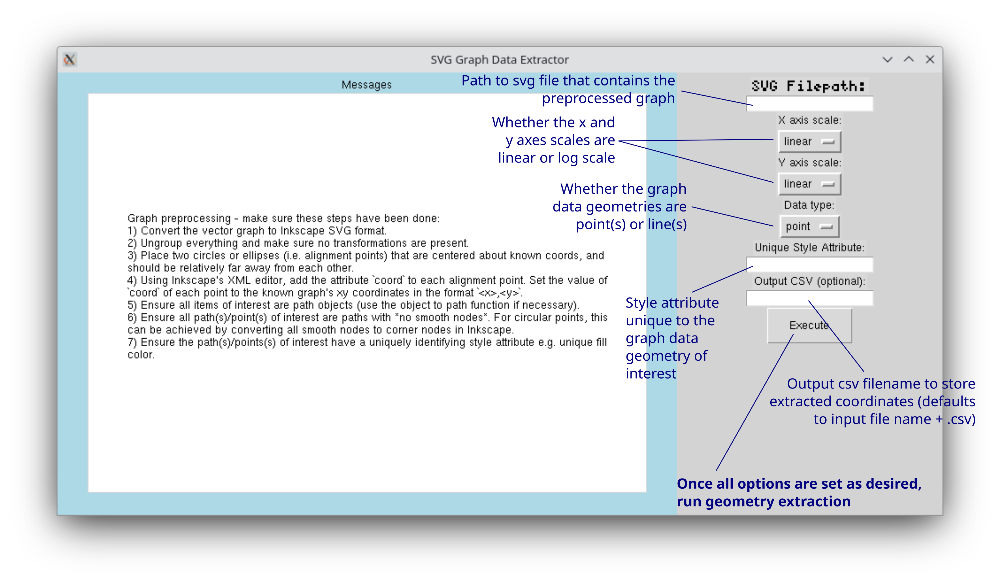
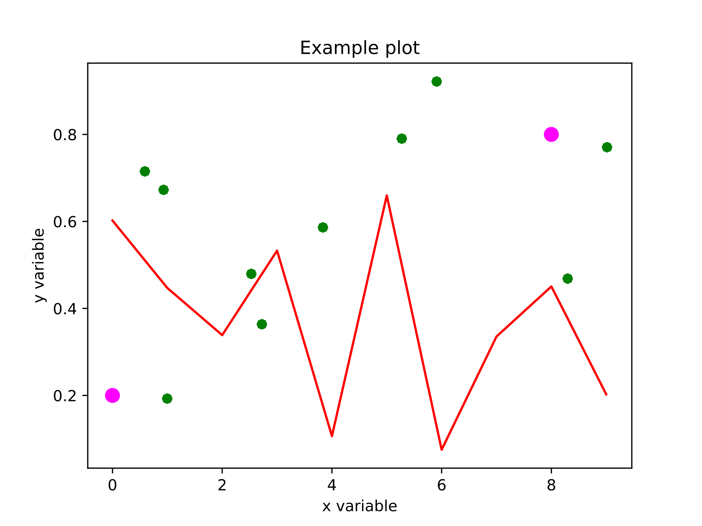
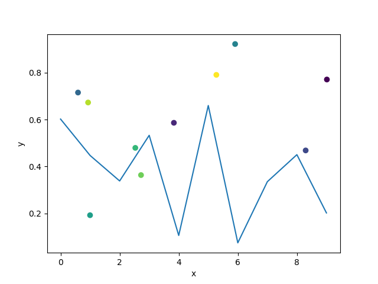
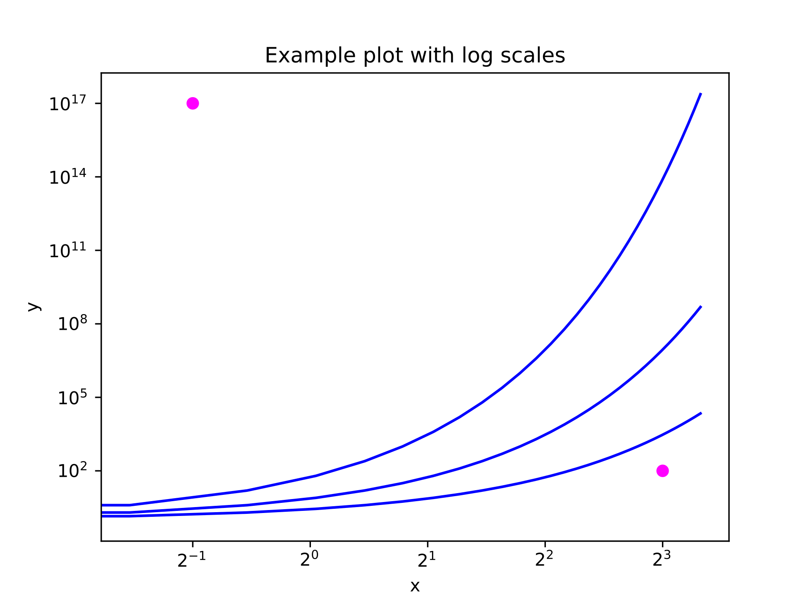
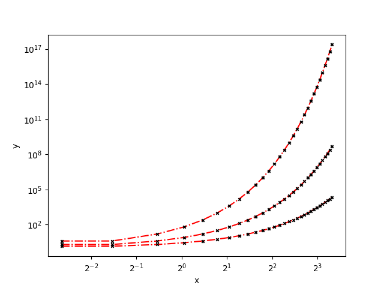
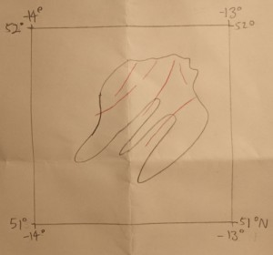
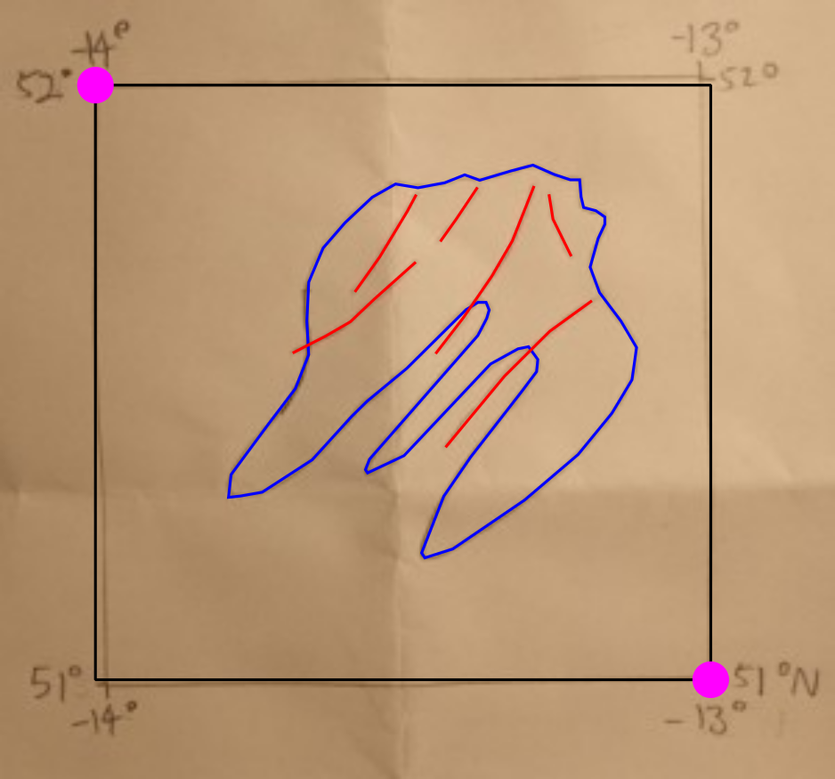
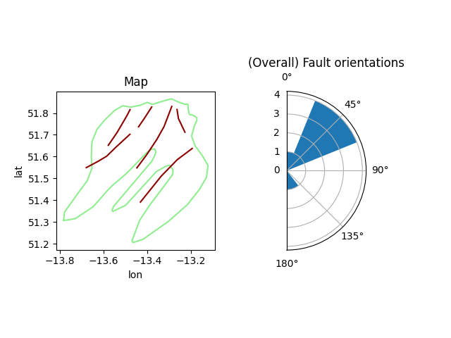

Extract coordinates from vector graphic plots after Inkscape preprocessing.

The extracted coordinates are in graph coordinates.

For the full set of preprocessing steps, run `gui.py`, which will bring up the list in the message box:

# Examples

## Example 1: Linear x and y axes, with points and one line

The original graphic is `example.pdf`, which is preprocessed (converted to svg, objects all ungrouped, alignment points added and curved nodes converted to corner nodes - i.e. the circular points are now octagons) to `example.svg`, which looks like (green points are "data", the pink points (which is a circle object in svg) are alignment points):

`gui.py` is run to bring up the (currently very simple) gui for graph data extraction. The axes are linear for both x and y.

-   For the line, the unique style is "ff0000"
    -   Extracted data is saved to `line.csv`
-   For the points, the unique style is "008000"
    -   Extracted data is saved to `points.csv`

The graph data is now extracted, and can be replotted. The example uses `replot_example.py` to produce:

## Example 2: Log x and y axes (different exponents), with multiple lines

The original graphic is `example.pdf`, which is preprocessed (converted to svg, objects all ungrouped and alignment points added) to `example.svg`, which looks like (blue lines are "data", the pink points are alignment points):

`gui.py` is run to bring up the gui for graph data extraction. The axes are log for both x and y. Note that the log base doesn't need to be specified, and that the log10 y scale and log2 x scale are handled separately by the code in this example.

-   For the lines, the unique style is "0000ff"
    -   Extracted data is saved to `lines.csv`

The graph data is now extracted, and can be replotted. The example uses `replot_example.py` to produce:

## Example 3: Image data digitisation example: fault lines

This example demonstrates the digitisation of data from an image (which could be a sketch, or a digital plot that's only available in raster format) after manual tracing of data into a vector format. Here, the original graphic is `map.png` (a synthetic map purely for demonstration purposes*), which looks like:

This is processed (traced) to `example.svg`, which looks like (pink points are alignment points, red lines are faults, the blue line is the synthetic island coastline):

`gui.py` is run to bring up the gui for graph data extraction. The axes are linear for both x and y.

-   For the faults, the unique style is "ff0000"
    -   Extracted data is saved to `faults.csv`
-   For the coastline the unique style is "0000ff"
    -   Extracted data is saved to `coastline.csv`

The map data is now extracted, and can be replotted. A very basic data analysis (fault orientation histogram, where the fault orientation is found from the first and last point on the fault geometry) from the extracted data is also shown. The example uses `replot_example.py` to produce:

*Note that the assumption must be made that the map is equirectangularly projected such that the longitude and latitude axes are effectively linear. Image distortion is also ignored.
