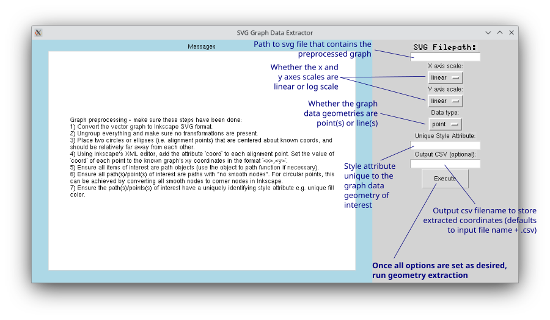
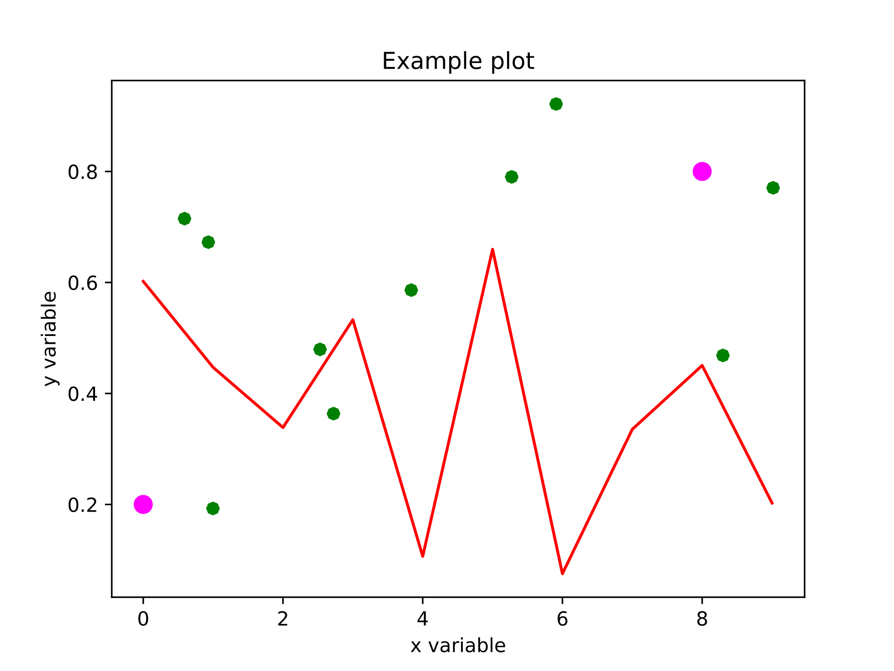
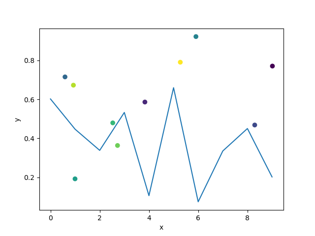

Extract coordinates from vector graphic plots after Inkscape preprocessing.

The extracted coordinates are in graph coordinates.

For the full set of preprocessing steps, run `gui.py`, which will bring up the list in the message box:

# Example

The original graphic is `example.pdf`, which is preprocessed (converted to svg, objects all ungrouped, alignment points added and curved nodes converted to corner nodes - i.e. the circular points are now octagons) to `example.svg`, which looks like (green points are "data", the pink points (which is a circle object in svg) are alignment points):

`gui.py` is run to bring up the (currently very simple) gui for graph data extraction. The axes are linear for both x and y.

-   For the line, the unique style is "ff0000"
    -   Extracted data is saved to `line.csv`
-   For the points, the unique style is "#008000"
    -   Extracted data is saved to `points.csv`

The graph data is now extracted, and can be replotted. The example uses `replot_example.py` to produce:

